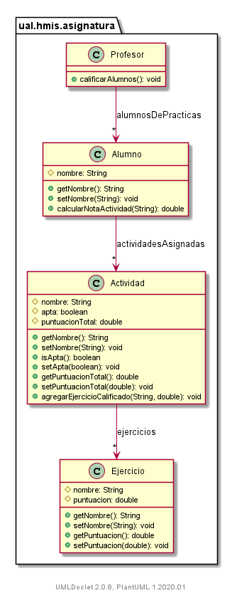
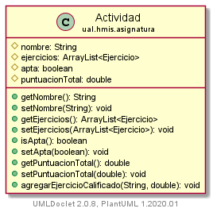
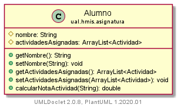
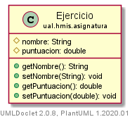
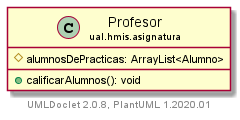

# Ejercicio JUnit

A partir de las clases proporcionadas, implemente el método de la clase `Alumno` denominado `calcularNotaActividad` que recibe por parámetro el nombre de una actividad y que devuelva un `double` con la suma de la puntuación de todos los ejercicios de dicha actividad. En la ejecución de dicho método, se debe actualizar el valor de la propiedad (`puntuacionTotal`) de la clase `Actividad`.

Implemente los casos de prueba en JUnit necesarios para obtener un **100% de cobertura** para el nuevo método `calcularNotaActividad`, usando los *valores límite* adecuados donde proceda.

A continuación se muestra el diagrama de clases del paquete `ual.hmis.asignatura`: 

Y las clases una por una: 

